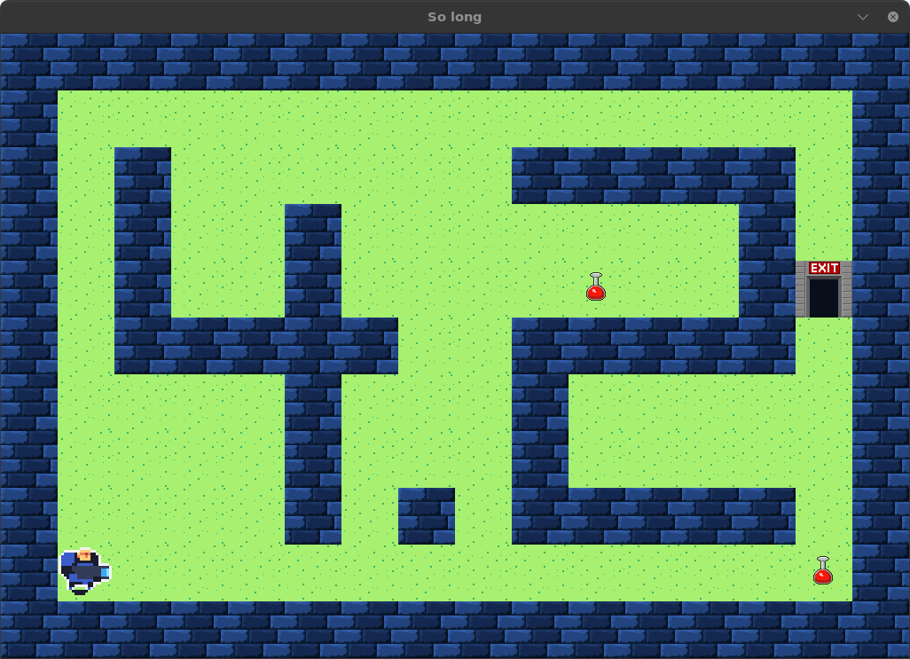

# <span class="h1">So Long</span>

<p align="center"><em>Petit jeux 2D avec la minilibx 42</em></p>

---

## <span class="h2">Presentation</span>

L'objectif est de créer un jeux 2D en ***C*** avec la minilibx.

## <span class="h2">Installation</span>

Pour commencer il faut cloner le dépôt :

```bash
> git clone https://github.com/Lamizana/So-long.git
```

Accéder ensuite aux exécutables :

```bash
> cd so_long
> ls
> so_long git:(main) ✗ ls
carte_01.ber  carte_03.ber        carte_04_bonus.ber  ft_errors.c      ft_inits.c  ft_parse_road.c  gnl     main.c    mlx_linux  so_long_bonus  so_long.h
carte_02.ber  carte_03_bonus.ber  ft_display.c        ft_event_move.c  ft_move.c   ft_parsing.c     images  Makefile  so_long    solong_bonus   so_long_utils.c
```

Il y a 2 types de So Long :

* `so_long`: le So Long de base qui fonctionne avec les map standard :
* `solong-bonus`: Fonctionne avec les cartes Bonus.

---

## <span class="h2">Comment jouer</span>

Pour lancer le `solong`:

```bash
> ./so_long carte_03.ber             # à la racine du projet
```

Pour lancer le `solong`:

```bash
> ./solong_bonus carte_03.ber        # à la racine du projet
```

Le jeux se lance alors dans une fenétre indépendante :

{.shadowed-image}
